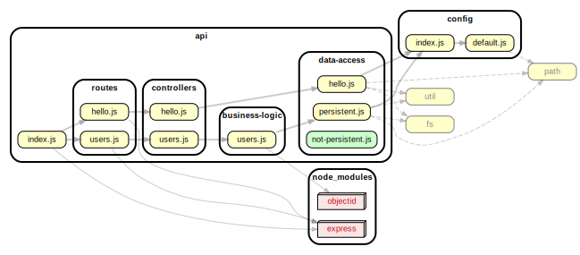

<!-- BEGIN title -->

# API

<!-- END title -->

<!-- BEGIN TREE -->

<!-- END TREE -->

<!-- BEGIN TOC -->

- business-logic
  - [users.js](#apibusiness-logicusersjs)
- controllers
  - [hello.js](#apicontrollershellojs)
  - [users.js](#apicontrollersusersjs)
- data-access
  - [hello.js](#apidata-accesshellojs)
  - [not-persistent.js](#apidata-accessnot-persistentjs)
  - [persistent.js](#apidata-accesspersistentjs)
- middleware
- routes
  - [hello.js](#apirouteshellojs)
  - [users.js](#apiroutesusersjs)
- utils
- [index.js](#apiindexjs)

---

<!-- END TOC -->

---

<!-- BEGIN DOCS -->

# /business-logic

<a href="../../api/business-logic/users.js" id="apibusiness-logicusersjs">../api/business-logic/users.js</a>

---

# /controllers

<a href="../../api/controllers/hello.js" id="apicontrollershellojs">../api/controllers/hello.js</a>

<a href="../../api/controllers/users.js" id="apicontrollersusersjs">../api/controllers/users.js</a>

---

# /data-access

<a href="../../api/data-access/hello.js" id="apidata-accesshellojs">../api/data-access/hello.js</a>

## Functions

<dl>
<dt><a href="#constructFilePath">constructFilePath(fileName)</a> ⇒ <code>string</code></dt>
<dd>
Generates an absolute path for a specific file in the app&#39;s data.

</dd>
<dt><a href="#readHello">readHello()</a> ⇒ <code>Promise.&lt;string&gt;</code></dt>
<dd>
Reads the contents of &quot;hello.txt&quot;.

</dd>
</dl>

## constructFilePath(fileName) ⇒ <code>string</code>

Generates an absolute path for a specific file in the app's data.

**Returns**: <code>string</code> - An absolute path to that file.

| Param    | Type                | Description       |
| -------- | ------------------- | ----------------- |
| fileName | <code>string</code> | The file to read. |

## readHello() ⇒ <code>Promise.&lt;string&gt;</code>

Reads the contents of "hello.txt".

**Returns**: <code>Promise.&lt;string&gt;</code> - Text content from the "hello.txt" file.

<a href="../../api/data-access/not-persistent.js" id="apidata-accessnot-persistentjs">../api/data-access/not-persistent.js</a>

<a href="../../api/data-access/persistent.js" id="apidata-accesspersistentjs">../api/data-access/persistent.js</a>

---

# /middleware

---

# /routes

<a href="../../api/routes/hello.js" id="apirouteshellojs">../api/routes/hello.js</a>

<a href="../../api/routes/users.js" id="apiroutesusersjs">../api/routes/users.js</a>

---

# /utils

---

<a href="../../api/index.js" id="apiindexjs">../api/index.js</a>

<!-- END DOCS -->
