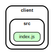

<!-- BEGIN title -->

# CLIENT

<!-- END title -->

<!-- BEGIN TREE -->

<!-- END TREE -->

<!-- BEGIN TOC -->

- src
  - [index.js](#clientsrcindexjs)

---

<!-- END TOC -->

---

<!-- BEGIN DOCS -->

# /src

<a href="../../client/src/index.js" id="clientsrcindexjs">../client/src/index.js</a>

## header([text]) ⇒ <code>HTMLHeadingElement</code>

Renders some text into a header with class "fancy".

**Returns**: <code>HTMLHeadingElement</code> - A header containing the text.

| Param  | Type                | Default                               | Description         |
| ------ | ------------------- | ------------------------------------- | ------------------- |
| [text] | <code>string</code> | <code>&quot;&#x27;&#x27;&quot;</code> | The text to render. |

---

<!-- END DOCS -->
